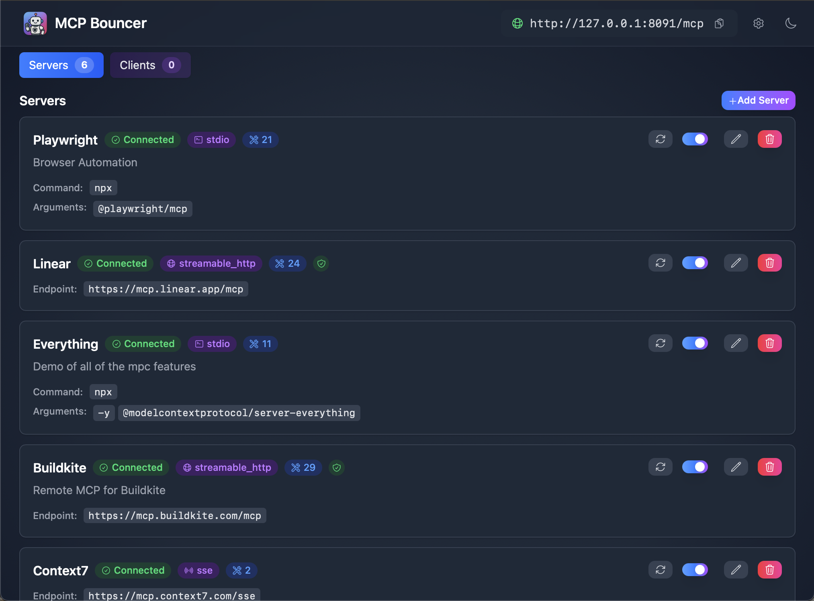

# MCP Bouncer

A desktop application that serves as a gateway and management interface for Model Context Protocol (MCP) servers. Now built with Tauri v2 (Rust + WebView) and the official Rust MCP SDK (rmcp). It provides a modern, cross‑platform GUI for configuring, managing, and monitoring MCP servers with support for multiple transport protocols.



> **⚠️ Early Development Software**
> This project is in early development and may have bugs, incomplete features, or breaking changes. Use at your own risk and please report any issues you encounter.

## What is MCP Bouncer?

MCP Bouncer acts as a centralized hub for managing Model Context Protocol servers. It allows you to:

- **Configure multiple MCP servers** with different transport protocols (stdio, SSE, HTTP)
- **Start/stop servers** individually or all at once
- **Monitor server status** and connection health in real-time
- **Persist configurations** across application restarts
- **Manage environment variables** and command-line arguments for each server

## Features

### 🚀 Server Management
- Add, edit, and remove MCP server configurations
- Enable/disable servers individually
- Bulk start/stop operations
- Real-time status monitoring with connection health indicators

### 🔧 Transport Protocol Support
- **stdio**: Process‑based transport for local MCP servers (via rmcp TokioChildProcess)
- **Streamable HTTP**: HTTP transport with streaming capabilities (via rmcp client/server)
- SSE transport is supported; the UI models it and the backend includes an integration test validating header forwarding and tool listing.

### 🎨 Modern UI
- Clean, responsive interface built with React and Tailwind CSS
- Dark/light theme support
- Toast notifications for user feedback
- Compact, efficient layout design

### 👀 Incoming Clients
- As MCP clients connect to the built‑in Streamable HTTP server, they appear in the Incoming Clients list.
- Shows reported client `name`, `version`, and optional `title` (when provided by the client during Initialize).
- Connection time `connected_at` is in RFC3339 (ISO 8601) format for reliable display in the UI.

### ⚙️ Configuration Management
- Automatic settings persistence in platform-specific locations
- JSON-based configuration format
- Easy access to configuration directory
- Environment variable management per server

### 🔌 MCP Client Integration
- Built-in MCP client for testing server connections
- Real-time connection status updates
- Error reporting and debugging information

## Quick Start

### Prerequisites
- Node.js 18+
- Rust toolchain (stable, recent enough for `edition = 2024`)
- Tauri CLI (optional): `npm i -g @tauri-apps/cli` or use `npx tauri`

### Development
1. Clone the repository:
   ```bash
   git clone https://github.com/catkins/mcp-bouncer.git
   cd mcp-bouncer
   ```
2. Install frontend deps:
   ```bash
   npm install
   ```
3. Dev run (Vite + Tauri):
   ```bash
   npx tauri dev
   # or
   tauri dev
   ```

### Building
```bash
# Build the web assets and bundle the app
cargo tauri build

# Or separately
npm run build
cargo build --manifest-path src-tauri/Cargo.toml --release
```

## Configuration

### Settings Location
The application automatically manages settings in platform-specific locations:

- **macOS**: `~/Library/Application Support/mcp-bouncer/settings.json`
- **Linux**: `~/.config/mcp-bouncer/settings.json`
- **Windows**: `%APPDATA%\mcp-bouncer\settings.json`

### Configuration Format

```json
{
  "mcp_servers": [
    {
      "name": "filesystem",
      "description": "Filesystem MCP server for file operations",
      "transport": "stdio",
      "command": "npx",
      "args": ["@modelcontextprotocol/server-filesystem"],
      "env": {
        "MCP_FILESYSTEM_ROOT": "/Users/username/Documents"
      },
      "enabled": true
    },
    {
      "name": "remote-server",
      "description": "Remote MCP server using HTTP transport",
      "transport": "streamable_http",
      "endpoint": "https://example.com/mcp/stream",
      "headers": {
        "Authorization": "Bearer your-token-here"
      },
      "enabled": false
    }
  ],
  "listen_addr": "http://localhost:8091/mcp",
}
```

### Server Configuration Options

| Field | Type | Required | Description |
|-------|------|----------|-------------|
| `name` | string | Yes | Unique identifier for the server |
| `description` | string | No | Human-readable description |
| `transport` | string | Yes | Transport type: `stdio`, `sse`, or `streamable_http` |

### SSE Transport
- Endpoint: set `endpoint` to your server's SSE base (e.g., `http://127.0.0.1:8080/sse`).
- Headers: optional `headers` object attaches static HTTP headers to SSE requests (useful for API keys).
- Behavior: the app lists tools and forwards headers on tool calls; see `src-tauri/tests/sse_integration.rs` for an example.
| `command` | string | For `stdio` | Command to execute |
| `args` | array | For `stdio` | Command-line arguments |
| `env` | object | No | Environment variables |
| `endpoint` | string | For HTTP | HTTP endpoint URL |
| `headers` | object | For HTTP | HTTP headers |
| `enabled` | boolean | No | Auto-start on application launch |

## Project Structure

```
mcp-bouncer/
├── src/                      # React + TypeScript source
├── public/                   # Static assets
├── index.html                # Vite entry
├── package.json              # Frontend scripts/deps
├── vite.config.ts            # Vite config
├── src-tauri/                # Tauri (Rust) crate
│   ├── Cargo.toml
│   ├── build.rs              # Generates a placeholder icon if missing
│   ├── tauri.conf.json       # Tauri v2 configuration
│   ├── capabilities/
│   │   └── events.json       # Grants event.listen to main window
│   └── src/
│       ├── lib.rs            # Backend library exposing modules for tests/commands
│       ├── config.rs         # Settings + client-state persistence and shared types
│       ├── client.rs         # RMCP client lifecycle and registry helpers
│       ├── status.rs         # Client status aggregation logic
│       ├── events.rs         # Event emission abstraction + helpers
│       ├── app_logic.rs      # Thin orchestration adapters (e.g., settings update)
│       ├── incoming.rs       # In‑memory registry for incoming clients (Initialize)
│       └── main.rs           # App entry; thin Tauri commands wiring
└── settings.example.json     # Example configuration
```

## Usage Examples

### Adding a Filesystem MCP Server
1. Click "Add Server" in the UI
2. Configure with:
   - Name: `filesystem`
   - Transport: `stdio`
   - Command: `npx`
   - Args: `["@modelcontextprotocol/server-filesystem"]`
   - Environment: `{"MCP_FILESYSTEM_ROOT": "/path/to/root"}`

### Adding a Remote HTTP Server
1. Click "Add Server" in the UI
2. Configure with:
   - Name: `remote-api`
   - Transport: `streamable_http`
   - Endpoint: `https://api.example.com/mcp/stream`
   - Headers: `{"Authorization": "Bearer your-token"}`

## Development

### Architecture
- **Backend**: Rust (Tauri v2). Hosts an rmcp Streamable HTTP server at `http://127.0.0.1:8091/mcp`.
  - Aggregates and proxies to configured upstream MCP servers (Streamable HTTP, STDIO) via rmcp clients.
  - Tool names are prefixed `server::tool` to disambiguate across servers.
  - Emits UI events (servers_updated, settings:updated, client_status_changed, client_error, incoming_clients_updated).
  - Tracks incoming clients on rmcp Initialize; timestamps are RFC3339 for easy JS parsing.
  - Code is split into focused modules (config, client, status, events) for testability; `main.rs` stays thin.
- **Frontend**: React 19 + TypeScript + Tailwind CSS 4 + Vite.
  - Uses `@tauri-apps/api` and a small adapter at `src/tauri/bridge.ts` for commands and events.
- **Settings**: JSON at `$XDG_CONFIG_HOME/mcp-bouncer/settings.json`.

### Dev Commands
- Dev app: `npx tauri dev`
- Build app: `cargo tauri build`
- Just backend: `cargo build --manifest-path src-tauri/Cargo.toml`
- Just frontend: `npm run dev` / `npm run build`

From the repository root, pass `--manifest-path` for Rust backend workflows:

```bash
# Type-check backend from root
cargo check --manifest-path src-tauri/Cargo.toml

# Run backend tests from root
cargo test --manifest-path src-tauri/Cargo.toml --lib --tests

# Build backend only from root
cargo build --manifest-path src-tauri/Cargo.toml
```

## Contributing

1. Fork the repository
2. Create a feature branch
3. Make your changes
4. Test thoroughly
5. Submit a pull request

## License

This project is licensed under the MIT License - see the LICENSE file for details.

## Related Links

- [Model Context Protocol](https://modelcontextprotocol.io/)
- [Tauri v2 Docs](https://v2.tauri.app/)
- [rmcp (Rust MCP SDK)](https://docs.rs/rmcp/latest/rmcp/)
