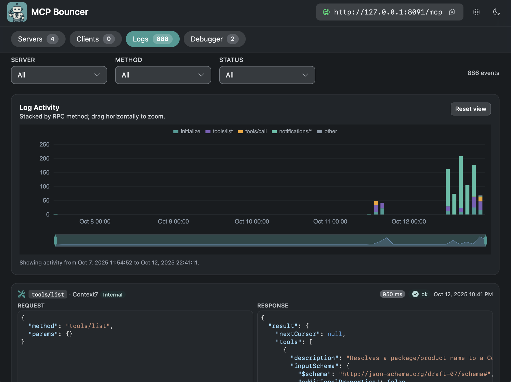

# MCP Bouncer

A desktop application that serves as a gateway and management interface for Model Context Protocol (MCP) servers. Now built with Tauri v2 (Rust + WebView) and the official Rust MCP SDK (rmcp). It provides a modern, cross‑platform GUI for configuring, managing, and monitoring MCP servers with support for multiple transport protocols.

## Screenshots





> **⚠️ Early Development Software**
> This project is in early development and may have bugs, incomplete features, or breaking changes. Use at your own risk and please report any issues you encounter.

## What is MCP Bouncer?

MCP Bouncer acts as a centralized hub for managing Model Context Protocol servers. It allows you to:

- **Configure multiple MCP servers** with different transport protocols (stdio, SSE, HTTP)
- **Start/stop servers** individually or all at once
- **Monitor server status** and connection health in real-time
- **Persist configurations** across application restarts
- **Manage environment variables** and command-line arguments for each server

## Features

### 🚀 Server Management

- Add, edit, and remove MCP server configurations
- Enable/disable servers individually
- Bulk start/stop operations
- Real-time status monitoring with connection health indicators

### 🔧 Transport Protocol Support

- **stdio**: Process‑based transport for local MCP servers (via rmcp TokioChildProcess)
- **Streamable HTTP**: HTTP transport with streaming capabilities (via rmcp client/server)
- SSE transport is supported; the UI models it and the backend includes an integration test validating header forwarding and tool listing.
- Built-in proxy exposure now supports TCP (default), Unix sockets, and stdio via `settings.transport`; see Proxy Transport Settings.

### 🎨 Modern UI

- Clean, responsive interface built with React and Tailwind CSS
- Dark/light theme support
- Toast notifications for user feedback
- Compact, efficient layout design

### 👀 Incoming Clients

- As MCP clients connect to the built‑in Streamable HTTP server, they appear in the Incoming Clients list.
- Shows reported client `name`, `version`, and optional `title` (when provided by the client during Initialize).
- Connection time `connected_at` is in RFC3339 (ISO 8601) format for reliable display in the UI.

### ⚙️ Configuration Management

- Automatic settings persistence in platform-specific locations
- JSON-based configuration format
- Easy access to configuration directory
- Environment variable management per server

### 🔒 Secure Secret Storage

- OAuth access and refresh tokens are encrypted/stored via the operating system keyring using the cross-platform `keyring` crate—no sensitive token payloads remain in `oauth.json`.
- On first run after upgrading, legacy plaintext credentials are migrated into the keyring and scrubbed from the JSON file automatically.
- The same abstraction will power upcoming named secrets for injecting headers, environment variables, or CLI parameters.

### 🔌 MCP Client Integration

- Built-in MCP client for testing server connections
- Real-time connection status updates
- Error reporting and debugging information

### 🪵 JSON-RPC Logging (SQLite)

- Always-on logging of all JSON-RPC requests/responses handled by the proxy.
- Location: `logs.sqlite` in the app config directory:
  - macOS: `~/Library/Application Support/app.mcp.bouncer/logs.sqlite`
  - Linux: `~/.config/app.mcp.bouncer/logs.sqlite`
  - Windows: `%APPDATA%\\app.mcp.bouncer\\logs.sqlite`
- Schema overview:
  - `sessions(session_id, created_at_ms, client_name, client_version, client_protocol, last_seen_at_ms)`
  - `rpc_events(id, ts_ms, session_id, method, server_name, server_version, server_protocol, duration_ms, ok, error, request_json, response_json)`
- Sensitive fields are masked recursively (authorization, token, password, secret, api_key, access_token).
- The logger batches writes (~250 ms), runs connections in WAL mode, and periodically triggers `PRAGMA wal_checkpoint(TRUNCATE)`; on shutdown it attempts a final flush + checkpoint.
- The frontend queries this database directly through `@tauri-apps/plugin-sql` (`src/lib/sqlLogging.ts`), so there are no dedicated Tauri commands for log listing or histograms.
- Quick queries:
  - `SELECT COUNT(*) FROM rpc_events;`
  - `SELECT DISTINCT method FROM rpc_events;`
  - `SELECT * FROM rpc_events ORDER BY ts_ms DESC LIMIT 10;`

### 🛰️ Intercepting Transport Architecture

- **Inbound proxy traffic**: The embedded Streamable HTTP server wraps every session transport with an `InterceptingTransport` via `InterceptingSessionManager`. Each inbound request is annotated with a `RequestLogContext`, which captures timings, injects server/client metadata, and pushes events to the SQLite logger and live UI stream.
- **Outbound upstream traffic**: All upstream RMCP clients created by `ensure_rmcp_client` use `InterceptingClientTransport`, wrapping HTTP/SSE/stdio transports before `.serve(...)` runs. This guarantees that tool refreshes, OAuth reconnects, and user-triggered calls record the same structured events (including errors) as downstream traffic.
- Both interceptors share the `RpcEventPublisher` + `EventEmitter`, so extending to new transports only requires wrapping the transport and passing the emitter/logger through. Pending-request state stores start timestamps, serialized payloads, and resolves human-readable errors (e.g., callTool content) for consistent SQLite records.

## Quick Start

### Prerequisites

- Node.js 18+
- Rust toolchain (stable, recent enough for `edition = 2024`)
- Tauri CLI (optional): `npm i -g @tauri-apps/cli` or use `npx tauri`
- Linux only: install `keyutils`/`libkeyutils` so the system keyring backend is available for OAuth secret storage.

### Development

1. Clone the repository:

   ```bash
   git clone https://github.com/catkins/mcp-bouncer.git
   cd mcp-bouncer
   ```

2. Install frontend deps:

   ```bash
   npm install
   ```

3. Dev run (Vite + Tauri):

   ```bash
   npx tauri dev
   # or
   tauri dev
   ```

### Building

```bash
# Build the web assets and bundle the app
cargo tauri build

# Or separately
npm run build
cargo build --manifest-path src-tauri/Cargo.toml --release
```

## Configuration

### Settings Location

The application automatically manages settings in platform-specific locations:

- **macOS**: `~/Library/Application Support/app.mcp.bouncer/settings.json`
- **Linux**: `~/.config/app.mcp.bouncer/settings.json`
- **Windows**: `%APPDATA%\app.mcp.bouncer\settings.json`

### OAuth Credentials & Secrets

- OAuth access/refresh tokens are stored in the operating system keyring (Keychain on macOS, Credential Manager on Windows, keyutils/secret-service on Linux) via the `keyring` crate.
- The on-disk `oauth.json` file now holds only metadata (client id, redirect URI, expiry). During the upgrade path legacy plaintext tokens are migrated into the keyring and removed from the file automatically.
- Future named secrets (for HTTP headers, env vars, or CLI params) will reuse the same abstraction; when testing locally, the backend automatically swaps in an in-memory secret store to avoid touching your real keychain.

### Configuration Format

```json
{
  "mcp_servers": [
    {
      "name": "filesystem",
      "description": "Filesystem MCP server for file operations",
      "transport": "stdio",
      "command": "npx",
      "args": ["@modelcontextprotocol/server-filesystem"],
      "env": {
        "MCP_FILESYSTEM_ROOT": "/Users/username/Documents"
      },
      "enabled": true
    },
    {
      "name": "remote-server",
      "description": "Remote MCP server using HTTP transport",
      "transport": "streamable_http",
      "endpoint": "https://example.com/mcp/stream",
      "headers": {
        "Authorization": "Bearer your-token-here"
      },
      "enabled": false
    }
  ],
  "listen_addr": "http://127.0.0.1:8091/mcp",
  "transport": "tcp"
}
```

### Server Configuration Options

| Field         | Type    | Required    | Description                                          |
| ------------- | ------- | ----------- | ---------------------------------------------------- |
| `name`        | string  | Yes         | Unique identifier for the server                     |
| `description` | string  | No          | Human-readable description                           |
| `transport`   | string  | Yes         | Transport type: `stdio`, `sse`, or `streamable_http` |
| `command`     | string  | For `stdio` | Command to execute                                   |
| `args`        | array   | For `stdio` | Command-line arguments                               |
| `env`         | object  | No          | Environment variables                                |
| `endpoint`    | string  | For HTTP    | HTTP endpoint URL                                    |
| `headers`     | object  | For HTTP    | HTTP headers                                         |
| `enabled`     | boolean | No          | Auto-start on application launch                     |

### Proxy Transport Settings

Configure how external MCP clients reach the built-in proxy via the top-level `transport` field in `settings.json`:

- `tcp` (default): Binds to `127.0.0.1:8091`. If that port is unavailable, MCP Bouncer falls back to an ephemeral port; the header badge updates using the runtime address returned by `mcp_listen_addr`.
- `unix` (macOS/Linux): Listens on `/tmp/mcp-bouncer.sock`. Any pre-existing socket file at that path is removed on startup before binding. Use the helper CLI `mcp-bouncer-socket-proxy` (see below) when a client expects a stdio bridge.
- `stdio`: Serves the proxy over standard input/output without creating a socket. Use this when embedding MCP Bouncer inside another supervisor and wiring pipes manually; the UI surfaces the listen address as `stdio`.

The persisted `listen_addr` remains for backward compatibility, but the live value displayed in the UI is derived from the active transport. Selecting `unix` on non-Unix platforms surfaces an explicit startup error.

#### Unix Socket Helper CLI

Expose a Unix-socket Bouncer over stdio for tools that only speak the MCP stdio transport:

```bash
cargo run --manifest-path src-tauri/Cargo.toml --bin mcp-bouncer-socket-proxy -- \
  --socket /tmp/mcp-bouncer.sock
```

- `--socket` points at the MCP Bouncer socket path (defaults to `/tmp/mcp-bouncer.sock`).
- `--endpoint` lets you override the HTTP path inside the unix socket (defaults to `/mcp`).
- The command reads requests from `stdin` and forwards them to the running Unix-socket proxy, writing responses back to `stdout`. This makes it safe to wrap with any stdio-compatible MCP client.
- Build a standalone binary with `cargo build --manifest-path src-tauri/Cargo.toml --bin mcp-bouncer-socket-proxy --release` (output lives at `src-tauri/target/release/mcp-bouncer-socket-proxy`).

Running the bridge typically looks like:

1. In `settings.json`, set the top-level `"transport": "unix"` and restart MCP Bouncer so it binds the socket.  
2. In a terminal, launch the proxy CLI (as above) to connect stdio ↔ unix.  
3. Point your stdio client at the bridge. Example with [`mcp-remote`](https://www.npmjs.com/package/mcp-remote):

   ```bash
   npx mcp-remote --transport stdio --command mcp-bouncer-socket-proxy -- --socket /tmp/mcp-bouncer.sock
   ```

For a richer inspection experience, try the official MCP Inspector:

```bash
npx -y @modelcontextprotocol/inspector -- ./src-tauri/target/release/mcp-bouncer-socket-proxy --socket /tmp/mcp-bouncer.sock
```

Start the CLI in one terminal (it will wait for connections), then launch the Inspector command in another to browse the advertised tools and send requests interactively.

When you bundle the desktop app (`cargo tauri build`), the helper binary is produced alongside the main application; ship both if Unix socket support is required.

### SSE Transport

- Endpoint: set `endpoint` to your server's SSE base (e.g., `http://127.0.0.1:8080/sse`).
- Headers: optional `headers` object attaches static HTTP headers to SSE requests (useful for API keys).
- Behavior: the app lists tools and forwards headers on tool calls; see `src-tauri/tests/sse_integration.rs` for an example.

## Project Structure

```
mcp-bouncer/
├── src/                      # React + TypeScript source
├── public/                   # Static assets
├── index.html                # Vite entry
├── package.json              # Frontend scripts/deps
├── vite.config.ts            # Vite config
├── src-tauri/                # Tauri (Rust) crate
│   ├── Cargo.toml
│   ├── build.rs              # Generates a placeholder icon if missing
│   ├── tauri.conf.json       # Tauri v2 configuration
│   ├── capabilities/
│   │   └── events.json       # Grants event.listen to main window
│   └── src/
│       ├── lib.rs            # Backend library exposing modules for tests/commands
│       ├── config.rs         # Settings + client-state persistence and shared types
│       ├── client.rs         # RMCP client lifecycle and registry helpers
│       ├── status.rs         # Client status aggregation logic
│       ├── events.rs         # Event emission abstraction + helpers
│       ├── commands.rs       # Tauri command handlers + thin orchestration adapters (settings, server events)
│       ├── incoming.rs       # In‑memory registry for incoming clients (Initialize)
│       └── main.rs           # App entry; bootstrap + plugin setup (generates TS bindings in debug)
├── src/tauri/bindings.ts     # Generated TS bindings (debug builds)
└── src/tauri/bridge.ts       # Thin wrapper over generated bindings for the UI
└── settings.example.json     # Example configuration
```

## Usage Examples

### Adding a Filesystem MCP Server

1. Click "Add Server" in the UI
2. Configure with:
   - Name: `filesystem`
   - Transport: `stdio`
   - Command: `npx`
   - Args: `["@modelcontextprotocol/server-filesystem"]`
   - Environment: `{"MCP_FILESYSTEM_ROOT": "/path/to/root"}`

### Adding a Remote HTTP Server

1. Click "Add Server" in the UI
2. Configure with:
   - Name: `remote-api`
   - Transport: `streamable_http`
   - Endpoint: `https://api.example.com/mcp/stream`
   - Headers: `{"Authorization": "Bearer your-token"}`

## Development

### Architecture

- **Backend**: Rust (Tauri v2). Hosts an rmcp Streamable HTTP server at `http://127.0.0.1:8091/mcp`.
  - Aggregates and proxies to configured upstream MCP servers (Streamable HTTP, STDIO) via rmcp clients.
  - Tool names are prefixed `server::tool` to disambiguate across servers.
  - Emits UI events (servers_updated, settings:updated, client_status_changed, client_error, incoming_clients_updated).
  - Tracks incoming clients on rmcp Initialize; timestamps are RFC3339 for easy JS parsing.
  - Code is split into focused modules (config, client, status, events) for testability; `main.rs` stays thin.
- **Frontend**: React 19 + TypeScript + Tailwind CSS 4 + Vite.
  - Uses `@tauri-apps/api` and a small adapter at `src/tauri/bridge.ts` for commands and events.
- **Settings**: JSON at `$XDG_CONFIG_HOME/app.mcp.bouncer/settings.json`.
- TypeScript bindings for Tauri commands and shared structs are generated automatically in debug builds using specta + tauri-specta. The generated file is at `src/tauri/bindings.ts`, and the frontend uses a thin adapter `src/tauri/bridge.ts` for ergonomic calls.

### Dev Commands

- Dev app: `npx tauri dev`
- Build app: `cargo tauri build`
- Just backend: `cargo build --manifest-path src-tauri/Cargo.toml`
- Just frontend: `npm run dev` / `npm run build`

From the repository root, pass `--manifest-path` for Rust backend workflows:

```bash
# Type-check backend from root
cargo check --manifest-path src-tauri/Cargo.toml

# Run backend tests from root
cargo test --manifest-path src-tauri/Cargo.toml --lib --tests

# Build backend only from root
cargo build --manifest-path src-tauri/Cargo.toml
```

## Contributing

1. Fork the repository
2. Create a feature branch
3. Make your changes
4. Test thoroughly
5. Submit a pull request

## License

This project is licensed under the MIT License - see the LICENSE file for details.

## Related Links

- [Model Context Protocol](https://modelcontextprotocol.io/)
- [Tauri v2 Docs](https://v2.tauri.app/)
- [rmcp (Rust MCP SDK)](https://docs.rs/rmcp/latest/rmcp/)
